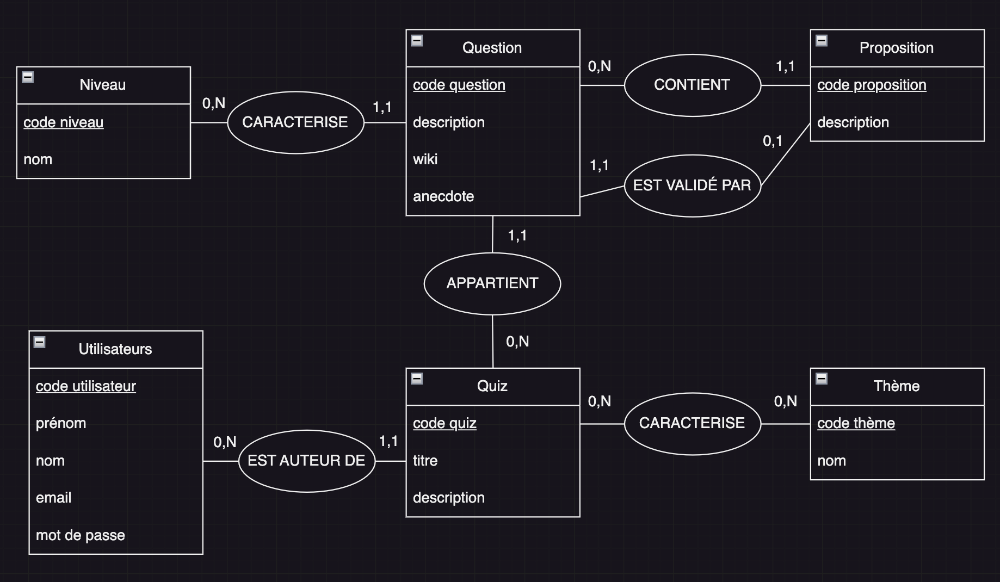

# Modèle Conceptuel de Données (MCD)

## Contexte

Le `MCD` fait partie d'une **méthodologie de modélisation** qu'on appelle la **méthode MERISE**.

Note : parfois on appelle le MCD un **diagramme d'entité-relation**.

MERISE 🇫🇷 (important pour le Titre Professionnel) : 
- MCD : qu'est-ce qu'on stock ?
- MLD : comment on stock ? 
- MPD : quels types on stock ?

D'autres méthode de modélisation de la BDD existe : `UML` (Unified Modeling Langage)

## Pourquoi ? 

- Répond à la question : **qu'est-ce qu'on stock ?**
- On doit pouvoir l'expliquer à mamie !
- Ce n'est pas un schema technique : c'est CONCEPTUEL ! 
- C'est un exercice **academique** donc avec un formalisme précis, rédiger générale en français 🇫🇷
- C'est un schema

Vocabulaire précis : 
- entités
- attributs
- cardinalité
- discriminant / déterminant / identifiant

Vocabulaire à bannir ici : 
- ID
- colonne / champs
- clé primaire / clé étrangère
- table
- table de liaision

## Etape 1 : définir les entités et leurs attributs

Etape brouillon : 

```
Utilisateur : nom, prénom, email, mot de passe
Quiz : titre, description
Question : description, wiki, anecdote
Proposition : description
Niveau : nom
Thème : nom
```

Note : Est-ce que une proposition peut revenir dans 2 questions différentes => NON. Pas de PROPOSITION LIÉE à deux QUESTIONS

Exemple de donénes à stocker : 
- QUIZ : Quiz de la tartiflette
  - QUESTION : Comment faut il couper les oignons
    - PROPOSITION 1 : en dé
    - PROPOSITION 2 : en lamelle
  - QUESTION : Quel type de fromage est généralement utilisé
    - PROPOSITION 1 : du reblochon
    - PROPOSITION 2 : du comté
    - PROPOSITION 3 : du beaufort

## Etape 2 : on schematique

Armes de poings
- papier/stylo
- `draw.io` (extension VSCode `Draw.io Integration` - fichier `.drawio`) 
- tldraw
- excalidraw

Armes lourdes
- [`MoCoDo`](https://www.mocodo.net/) 

## Etape 3 : souligner le discriminant

Le **discrimant** est l'attribut (ou les atributs dans le cas d'un discrimant composite) qui caractère de manière UNIQUE un entité. 

Exemple : 
- on ne peut pas avoir 2 utilisateurs avec le même email 
  - => `email` peut-être utilisé comme discriminant

- on peut avoir 2 propositions avec la même description 
  - => `proposition.description` ne peut pas être utilisé comme discriminant
  - => on rajoute un `code proposition` pour avoir un discriminant 
  - => par **cohérence**, on a ici rajouté `code <entité>` sur toutes les entités.

## Etape 4 : établir les associations

Une association = un block ROND entre 2 entités. Avec un nom de VERBE au présent de l'indicatif. Avec de part et d'autre de l'association des cardinalités.

Note : les associations, en fin de compte, seront stockées en base d'une certaines : 
- soit via un clé étrangère / clé primaire 
- soit via une table de liaison

Différence `0,N` et `1,N` :
- `0,N` : un niveau peut caractériser 0 questions. Exemple : un administrateur vient de CREER le niveau, il ne l'a pas encore assigné sur une question. => ca a du sens, c'est ce qu'on veut ! 
- `1,N` : un niveau au minimum être associé à une question => implique que, lorsqu'on créé le niveau, l'interface nous OBLIGE à lui choisir MINIMUM 1 question => pénible en terme d'utilisation. 


## Bilan 



