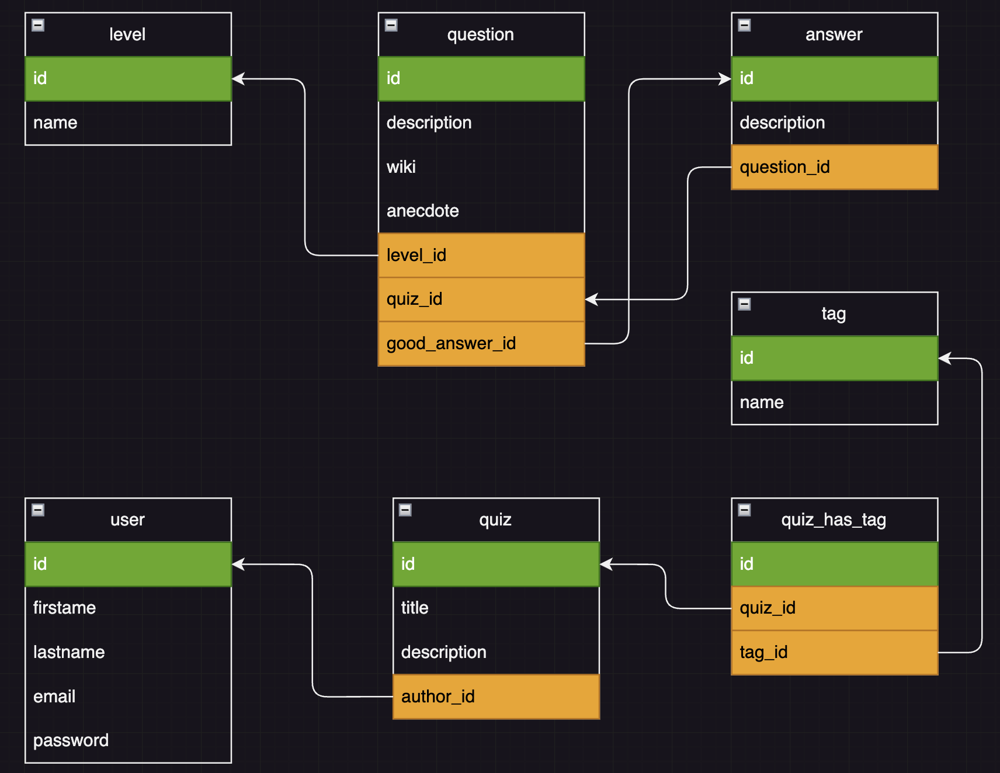

# Modèle Logique de Données (MLD)

Idée : exercice de traduction.
- On traduit le MCD dans une structure plus proche de l'implémentation dans la BDD.
- C'est une étape intermédiaire pour nous faciliter l'écriture des scripts `SQL`
- C'est uen étape de traduction (🇫🇷 => 🇺🇸), (cardinalité => clé étrangère/primaire)
- Note : à cette étape, on a pas encore choisi le `SGBD` (Postgres, MySQL, MongoDB, ...), on précise généralement pas les types de données (pas très grave si on les met)

Tradution : 
- Nom d'entité (🇫🇷) => Nom de table (🇺🇸)
- Nom d'attribut => Nom de champs/colonne
- Les cardinalités => Clé étrangères et/ou en tables de liaisons

Formalisme : 
- soit du texte 
- soit un schema 


## Traduction 

- Traduire les noms d'entité en nom de table 
- Traduire les noms d'attributs en nom de champs
- Traduire les cardinalités

### Règles de traduction des cardinalités

On regarde entre 2 entités le type d'association :
- One-To-One
- One-To-Many
- Many-To-Many

Pour ça, on prend le max de chaque côté de l'association


```
Niveau <-- 0,N ---> CARACTERISE <--- 1,1 ---> Question

        max(0,N)                    max(1,1)
        N                           1

==> Association 1-N ===> One-To-Many
```

Traduction : 
- `One-To-One` : 
  - il suffit de rajouter un champ sur une des tables
  - (ou on peut la traduire comme une One-To-Many également)

- `One-To-Many` : 
  - il suffit d'ajouter une clé étrangère dans une des deux tables (celle proche du `1,1`) qui pointe vers la clé primaire de l'autre table

- `Many-To-Many` : 
  - il suffit d'ajouter une table de liaison qui porte 2 clés étrangères, chacune pointant vers la clé primaire des autres tables


## Format Texte

```
user (
  id  (#PK)
  firstname
  lastname
  email
  password
)

quiz (
  id ( #PK )
  title
  description
  author_id (#FK->user.id)
)

question (
  id ( #PK )
  description
  wiki
  anecdote
  level_id ( #FK->level.id )
  quiz_id ( #FK->quiz.id )
  good_answer_id ( #FK->answer.id)
)

answer (
  id ( #PK )
  description
  question_id ( #FK->question.id )
)

level (
  id ( #PK )
  name
)

tag (
  id ( #PK )
  name
)

quiz_has_tag (
  id ( #PK )
  quiz_id ( #FK->quiz.id )
  tag_id ( #FK->tag.id )
)

```

## Format Schema




### Explication `Many-To-Many` en BDD


```
# Notre problème

Quiz 1 : La tartiflette
  - Thèmes : Cuisine, Montagne
  - T2 : Montagne

Quiz 2 : Le ski
  - Thèmes : Montagne, Sport

Quiz 3 : La cuisine japonaise
  - Thèmes : Cuisine
```


```
Quiz1 (id: Q1, title: tartiflette)
Quiz2 (id: Q2, title: le ski)
Quiz3 (id: Q3, title: la cuisine japonaise)

Tag1 (id: T1, name: Cuisine)
Tag2 (id: T2, name: Montagne)
Tag3 (id: T3, name: Sport)


// Comment lier les quiz au tag ? 

Quiz_has_tag (quiz_id: Q1, tag_id: T1)   -- On ajoute cet enregistrement en BDD 
Quiz_has_tag (quiz_id: Q1, tag_id: T2)

Quiz_has_tag (quiz: Q2, tag_id T2)
Quiz_has_tag (quiz: Q2, tag_id T3)

Quiz_has_tag (quiz: Q3, tag_id T1)
```


