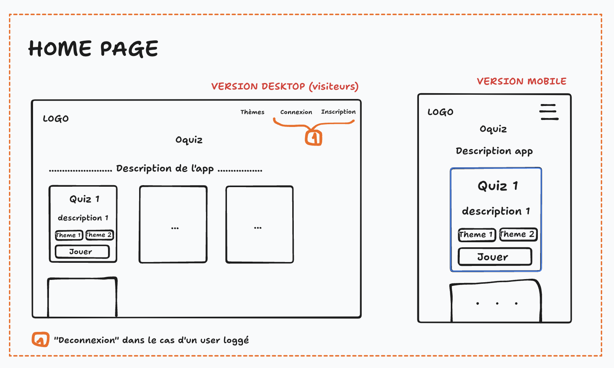

# Wireframes

## Kesako ?

Un `wireframe` c'est un schema "fonctionnel" d'une page.

Fonctionnel dans le sens où on comprend comment fonctionne la page et on voit les possibilités d'intéraction de l'utilsateur

Une sorte de **croquis** de l'application

Ce n'est pas le design final de l'application (on parle plutôt de Mockup/Maquette dans ce cas là)

C'est sobre : 
- c'est en NOIR ET BLANC (généralement pas de couleur)
- pas d'image

L'essentiel : 
- comprendre comment fonctionne la page

## Outils

Les armes poings :
- un papier / un stylo !
- un tableau blanc
- `paint`
- `excalidraw`
- `tldraw`
- `draw.io`

Les armes lourdes : 
- Figma
- Adobe XD

## Exemple

Le wireframe pour la home page 

